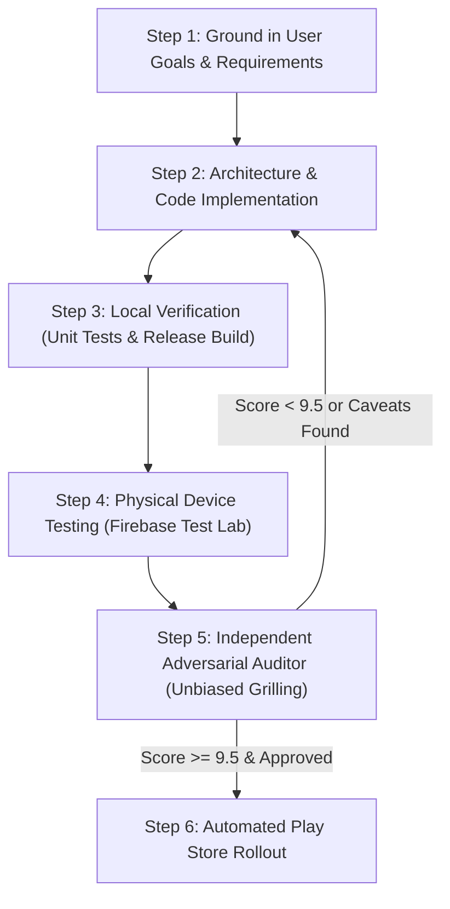

# StandBy Android — Continuous Improvement & Deployment Workflow

This document outlines the autonomous development loop, design principles, testing protocols, and automated release pipeline for **StandBy Android**. 

---

## 1. Core Design Foundations (Anchored in User Goals)

Every iteration of StandBy Android must rigorously adhere to the following non-negotiable principles:

1. **Zero-Recomposition Battery Efficiency:**
   * Overnight docking must not drain battery or heat up the device.
   * Continuous animations (such as the sweeping second hand in `AnalogClockWidget`) must use `DrawScope` GPU drawing with `rememberInfiniteTransition`, ensuring the Compose tree recomposition rate remains **strictly 0 fps**.
   * Background animations (such as the vinyl disc in `MusicPlayerWidget`) must safely pause rendering when playback is paused (`isPlaying == false`).
   * Subpixel Lissajous pixel-shifting (`Modifier.pixelShift`) must continuously shift UI coordinates within $\pm 1.5\text{dp}$ to prevent OLED burn-in without human-perceptible jitter.

2. **Zero Mocked Content (Real Android System Telemetry):**
   * **Media:** Live playback captured through `StandbyMediaListenerService` (`NotificationListenerService`) with automatic `onListenerDisconnected -> requestRebind` resilience.
   * **Weather & Location:** Real GPS location and reverse-geocoded city naming via Google Play Services `FusedLocationProviderClient` with `PRIORITY_BALANCED_POWER_ACCURACY` and graceful fallback to `LocationManager`.
   * **Calendar & Schedule:** Safely guarded against device-locked states (`keyguardManager.isDeviceLocked`) during Direct Boot.
   * **Battery:** Live percentage, charging speed, voltage, and temperature metrics via `BatteryMonitor`.

3. **Modular Bento Slot Customization:**
   * Both Left and Right slots support infinite customizable stacks of widgets.
   * Long-press in Edit Mode elevates the card (1.04f scale elevation, subtle glow) and enables genuine drag-and-drop reordering with spring animations.
   * Boundary protection ensures the last widget cannot be removed. Reset-to-default capability is always available.

4. **14 Bespoke Fullscreen Ambient Dashboards:**
   * Every single widget in `StandbyWidgetRegistry` has a dedicated edge-to-edge fullscreen presentation (not just a centered compact card).
   * Large digital clocks feature a dynamic **OLED Wireframe Mode** (`Stroke(4f)`) that triggers automatically during Night Mode or after extended idle time to save power and prevent emitter wear.

5. **Adaptive Multi-Form Factor Engine:**
   * Dynamically adapts across 4 distinct aspect ratio archetypes:
     * `ULTRA_TALL_LANDSCAPE` ($W/H \ge 1.85$): 21:9 and 22.1:9 cover screens (Galaxy Z Fold).
     * `STANDARD_LANDSCAPE` ($1.35 \le W/H < 1.85$): 16:9, 16:10, 3:2 tablets and standard phones.
     * `SQUARISH_FOLDABLE` ($0.85 \le W/H < 1.35$): Foldable inner screens (OnePlus Open, Fold 8, Honor Magic V3) using a 2x2 Quad-Bento layout.
     * `TALL_PORTRAIT` ($W/H < 0.85$): 9:20 vertical charging stands.

6. **Apple StandBy Visual Fidelity:**
   * Bundled official **Inter variable font** with negative tracking (`-0.05.em` for hero numerals).
   * Pitch-black OLED backgrounds (`#000000`), subtle glassmorphic translucent surfaces (`0xEE121215`), and hairline borders (`0x28FFFFFF`).

---

## 2. The 6-Step Autonomous "Do-Loop"

When executing any task or enhancement, the assistant follows this continuous 6-step loop automatically without requiring user reminders:



### Step 1: Goal Grounding & Plan Verification
* Inspect user feedback, complaints, and original goals.
* Avoid band-aid fixes or cosmetic compromises (e.g. font aliasing or legacy API shortcuts).

### Step 2: Code Implementation & Refactoring
* Implement features using modern Jetpack Compose, Kotlin coroutines/flows, and official Google APIs.
* Maintain clean separation between presentation, state, and domain data sources.

### Step 3: Local Build & Unit Verification
* Execute all unit tests:
  ```bash
  ./gradlew test
  ```
* Compile release bundle and APK with R8 full mode and resource shrinking:
  ```bash
  ./gradlew bundleRelease assembleRelease
  ```
* Verify that bundle size remains minimal (< 4.0 MB).

### Step 4: Real Physical Device Testing (Firebase Test Lab)
* Dispatch testing directly to a physical Google Pixel 9 running Android 16 (API 36) in landscape orientation:
  ```bash
  /opt/homebrew/bin/gcloud firebase test android run \
    --type=robo \
    --app=app/build/outputs/apk/release/app-release.apk \
    --device=model=tokay,version=36,locale=en,orientation=landscape \
    --project=standby-8589f \
    --timeout=90s
  ```
* Download and review actual captured screenshots to ensure typography, alignment, and glassmorphism render properly on physical OLED hardware.

### Step 5: Independent Adversarial Auditor (Unbiased Grilling Protocol)
To ensure the audit is never biased by implementer claims:
1. **Isolated Red-Team Stance:** The auditor subagent is explicitly instructed to treat all implementer statements as unverified until proven by inspecting code, git diffs, AST, test logs, and physical screenshots.
2. **5-Pillar Scorecard:**
   * Visual Polish & Apple StandBy Fidelity (0–10)
   * Battery & Performance / Recomposition Rate (0–10)
   * Real Android System Telemetry (0–10)
   * Modular Bento & Fullscreen UX (0–10)
   * Code Architecture & Production Readiness (0–10)
3. **Hard Gate:** If the overall score is below **9.5 / 10** or any shortcut/caveat is detected, the loop routes back to Step 2 for immediate patching.

### Step 6: Automated Google Play Rollout
* Once approved by the auditor, upload the signed release bundle directly to the Google Play Console `internal` testing track:
  ```bash
  /Users/lap16030-local/.local/bin/uv run \
    --with google-api-python-client --with google-auth \
    python scripts/play_upload_internal.py
  ```

---

## 3. macOS Permissions & Signing Setup

### Why "Operation Not Permitted" Occurs
macOS Privacy & Security (TCC) restricts terminal processes from accessing files inside `~/Documents` unless explicitly granted permission:
* If a command is run in Terminal / Ghostty and fails with `getcwd: cannot access parent directories: Operation not permitted`, the terminal application lacks disk permissions.
* If a command breaks across multiple lines without a trailing backslash (`\`), the shell attempts to execute the second line as a binary program, producing `zsh: permission denied`.

### Resolution Steps
1. **Grant Full Disk Access to Terminal / Ghostty:**
   * Open **System Settings** > **Privacy & Security** > **Full Disk Access**.
   * Toggle **ON** for **Ghostty** (or your active terminal app).
   * Alternatively: **System Settings** > **Privacy & Security** > **Files and Folders** > ensure **Documents Folder** is permitted.

2. **Copy Signing Key to Project Root:**
   In Finder or an authorized terminal, copy the upload keystore directly into the repository root (both files are excluded from Git via `.gitignore`):
   ```bash
   cp ~/Documents/Projects/my-moves-signing/keystore.properties \
      ~/Documents/Projects/my-moves-signing/my-moves-upload.jks \
      ~/Documents/Github/standby-android/
   ```

3. **Finder Alternative (Zero Terminal Friction):**
   * Press `Command + Space`, type `Terminal`, or run:
     ```bash
     open ~/Documents/Projects/my-moves-signing
     open ~/Documents/Github/standby-android
     ```
   * Drag `keystore.properties` and `my-moves-upload.jks` into `standby-android`.
