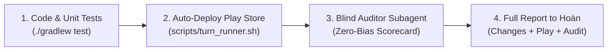
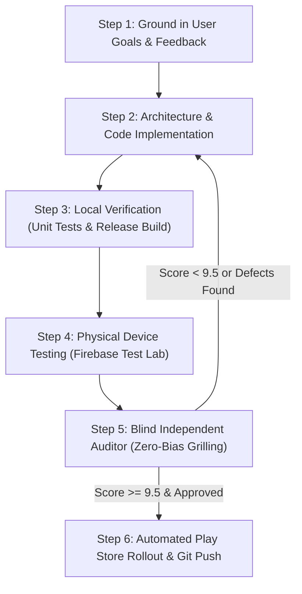

# StandBy Android — Continuous Improvement & Deployment Workflow

This document outlines the autonomous development loop, design principles, testing protocols, and automated release pipeline for **StandBy Android**.

---

## 0. MANDATORY ALL-TURN AUTOMATION CONTRACT (ZERO-OMISSION PROTOCOL)

**CRITICAL MANDATE:** In EVERY SINGLE TURN where features, bug fixes, or UI changes are requested or made, the assistant MUST execute and report the complete 4-stage pipeline before concluding the turn:



### The Turn-End Checklist (Never Skip Any Item):
1. **Zero-Collision Implementation:** Clean Compose architecture, OLED black (`#000000`), zero header/badge overlaps, zero mocked data.
2. **Automated Turn Pipeline (`scripts/turn_runner.sh`):**
   * Runs `./gradlew test` (guaranteeing 100% passing unit tests).
   * Compiles release AAB bundle & APK with R8 Full Mode.
   * Uploads bundle directly to **Google Play Console Internal Testing** via Android Publisher API.
   * Commits and pushes changes to GitHub `main`.
3. **Independent Adversarial Audit:** Spawns a fresh, blind `independent_code_auditor` subagent with no developer bias to inspect the code and physical screenshots, scoring the build against the 5-Pillar Scorecard.
4. **Mandatory Final Response Delivery:** Every turn response to Hoàn MUST include:
   - **Feature Summary:** Clear explanation of changes in simple, non-technical terms.
   - **Google Play Deployment Details:** Version code, track (`internal`), Edit ID, and bundle size.
   - **Full Auditor Scorecard & Verdict:** Aesthetics, Architecture, UX, Battery/Performance, and Production Readiness scores.

---

## 1. Core Design Foundations (Anchored in User Goals)

Every iteration of StandBy Android must rigorously adhere to the following non-negotiable principles:

1. **Zero-Recomposition Battery Efficiency & Monotonic OLED Protection:**
   * Overnight docking must not drain battery or heat up the device.
   * Continuous animations (such as the sweeping second hand in `AnalogClockWidget`) must use `DrawScope` GPU drawing with `rememberInfiniteTransition`, ensuring the Compose tree recomposition rate remains **strictly 0 fps**.
   * Background animations (such as the vinyl disc in `MusicPlayerWidget`) must safely pause rendering when playback is paused (`isPlaying == false`).
   * Subpixel Lissajous pixel-shifting (`Modifier.pixelShift` in `PixelShifter.kt`) must use monotonic `android.os.SystemClock.elapsedRealtime()` (immune to wall-clock or NTP shifts).
   * Shift cycles must maintain discrete rest intervals: **118 seconds of static sleep** (zero recomposition, zero CPU/GPU wake cycles) followed by a **2-second linear subpixel migration** within $\pm 1.5\text{dp}$.

2. **Zero Mocked Content (Real Android System Telemetry):**
   * **Media:** Live playback captured through `StandbyMediaListenerService` (`NotificationListenerService`) with automatic `onListenerDisconnected -> requestRebind` resilience and authentic "No Media Playing" empty state.
   * **Weather & Location:** Real GPS location and reverse-geocoded city naming via Google Play Services `FusedLocationProviderClient` with `PRIORITY_BALANCED_POWER_ACCURACY` and graceful fallback to `LocationManager`.
   * **Calendar & Schedule:** Every calendar item must explicitly display the **event date** (e.g. `UP NEXT · Today, Sep 20`) with relative micro-tags (`[ TODAY ]`, `[ TOMORROW ]`, `[ SEP 22 ]`), never bare time strings. Safely guarded against device-locked states (`keyguardManager.isDeviceLocked`) during Direct Boot.
   * **Battery:** Live percentage, charging speed, voltage, and temperature metrics via `BatteryMonitor`.

3. **Auto-Hiding Floating Navigation & Zero Collision Protocol:**
   * **Auto-Hide:** Floating top navigation bar (`StandbyTopNavigationMenu.kt`) auto-hides after 4.5 seconds of inactivity.
   * **Zero Collision:** When the menu is visible or in Edit Mode, content cards shift down via an animated top inset (`navTopInset by animateDpAsState(if (isNavVisible || isEditMode) 48.dp else 0.dp)`), completely eliminating overlap with clock numerals ("12") or calendar month headers ("SEPTEMBER").
   * **Non-Blocking Tap Interception:** Tap-to-show navigation uses `awaitEachGesture { awaitFirstDown(pass = PointerEventPass.Initial) }` on the root Box. This intercepts touches before child composables (buttons, sliders, pagers) can swallow them, guaranteeing instant navigation wakeup from anywhere on screen.
   * **100% Fullscreen Bento:** When the navigation bar auto-hides, `navTopInset` animates to `0.dp`, allowing cards to expand to 100% of the screen.

4. **Unified Edit Mode & Single-Header Architecture:**
   * Edit Mode is controlled solely by the top navigation bar (`StandbyTopNavigationMenu.kt`):
     - Left: `[ EDITING BENTO ]` status badge.
     - Center: `[ ⟲ Reset Defaults ]` pill.
     - Right: `[ Done ]` action button.
   * Bento cards must **never** render duplicate inner headers, slot title rows, or redundant action buttons.
   * Draggable widget stack (`EditModeWidgetStack.kt`) uses `LazyListState.layoutInfo` for dynamic item height measurement (never hardcoded pixel heights), with long-press elevation (`1.04f` scale + shadow) and snap haptic feedback.
   * Boundary protection ensures a minimum of 1 widget per slot stack.

5. **Responsive Scaling Across 3:4, Squarish Foldables & Tablets:**
   * Every widget (Analog Clock, Radial Clock, Big Digital Clock, Calendar, Weather) must scale within a `minOf(width, height)` bounding box with centered alignment.
   * Never rely on fixed aspect ratio assumptions that crop numerals on 3:4 tablets (e.g. 1536x2048) or squarish foldables (e.g. OnePlus Open ~1.08:1, Galaxy Z Fold inner screen ~1.16:1).

6. **14 Bespoke Fullscreen Ambient Dashboards:**
   * Every single widget in `StandbyWidgetRegistry` has a dedicated edge-to-edge fullscreen presentation (not just a centered compact card).
   * Large digital clocks feature a dynamic **OLED Wireframe Mode** (`Stroke(4f)`) that triggers automatically during Night Mode or after extended idle time to save power and prevent emitter wear.

7. **Apple StandBy Visual Fidelity:**
   * Bundled official **Inter variable font** with negative tracking (`-0.05.em` for hero numerals).
   * Pitch-black OLED backgrounds (`#000000`), subtle glassmorphic translucent surfaces (`0xEE121215`), and hairline borders (`0x28FFFFFF`).

8. **Zero-Emoji Mandate (Architectural Vector Standard):**
   * Raw cartoon emojis (e.g. ⚡, 📶, ᛒ, ☀️, 🌧️, 🔥, 🍃, ⏰, 📍, 🎵, ⛅, 💧) are strictly PROHIBITED across both UI views and data layers.
   * All iconography must be rendered via custom Canvas-drawn vector paths (`DrawScope`), Compose Vector Graphics (`Icons.Default.*`), or clean typographic badges.

9. **Independent Navigation & Auto-Hiding Indicator Overlays:**
   * Top navigation bar (`StandbyTopNavigationMenu.kt`) and all swipe indicators (horizontal screen indicator and vertical widget stack indicators) MUST be floating Z-axis overlays with ZERO layout padding or push on the underlying content (`navTopInset = 0.dp`).
   * When idle, indicators and navigation auto-hide completely after 4.5 seconds so 100% of the screen width and height is utilized by the widgets on pure OLED black.
   * Touching the screen or swiping brings back the floating overlays without causing layout shifts or squeezing.

10. **Authentic Apple StandBy Squircle Geometry & Minimalist Weather Hierarchy:**
    * Clock dials and bento widgets must adopt true continuous-curvature squircle geometry (superellipse / Lamé curve `(x/a)^4 + (y/b)^4 = 1`), dense perimeter ticks, 12 inward radial index rays, bold cardinal numerals (`12, 3, 6, 9`), clean baton hands, and hollow-center orange ring hub.
    * Weather displays must follow Apple StandBy's clean left-aligned vertical stack: City Name (Title Case) -> Monumental Temperature (100sp) -> Vector Weather Icon + Condition ("Sunny") + Daily Range ("H:91° L:62°"), borderless on pure pitch-black OLED.

11. **The Anti-Rubber-Stamp Adversarial Audit Mandate:**
    * The independent auditor must NEVER act as a passive checklist validator.
    * Perfect scores (10/10) are PROHIBITED unless an adversarial stress-test passes across 4 critical failure domains:
      1. **Active Gesture Transitions:** UI elements (indicators, navigation pills) must respond dynamically during active drags (`isScrollInProgress`), not just passive idle states.
      2. **Multi-Orientation Collision Tests:** Check portrait stacked columns vs landscape side-by-side rows to ensure overlays (Top Nav Menu, Quick Settings, Badges) never collide with card-level indicators or headers.
      3. **Data Boundary & Edge Math:** Fallback states (GPS denied, initial network load) must be tested with edge numerical inputs (e.g. `0` high/low values must never calculate `-17°C`).
      4. **Dynamic Typography Bounds:** All dynamic strings (city names, track titles, condition labels) must enforce single-line constraints (`maxLines = 1`) and ellipsis truncation (`TextOverflow.Ellipsis`) to prevent layout-push cascades.

---

## 2. The 6-Step Autonomous "Do-Loop"

When executing any task or enhancement, the assistant follows this continuous 6-step loop automatically without requiring user reminders:



### Step 1: Goal Grounding & Feedback Verification
* Review user feedback, previous defect reports, and original design goals.
* Avoid band-aid fixes or cosmetic shortcuts. Fix root causes at the architectural level.

### Step 2: Modular Implementation & Clean Refactoring
* Keep files focused and modular (< 500 lines per file).
* Separate concerns: coordinator (`MainStandbyPager.kt`), top bar (`StandbyTopNavigationMenu.kt`), slot container (`DynamicSlotCard.kt`), and edit stack (`EditModeWidgetStack.kt`).

### Step 3: Local Build & Unit Verification
* Execute all unit tests:
  ```bash
  ./gradlew test
  ```
* Compile release bundle and APK with R8 full mode and resource shrinking:
  ```bash
  ./gradlew bundleRelease assembleRelease
  ```
* Verify bundle size remains minimal (< 4.2 MB).

### Step 4: Real Physical Device Testing (Firebase Test Lab)
* Dispatch testing directly to a physical Google Pixel 9 running Android 16 (API 36) in both landscape and portrait orientations:
  ```bash
  /opt/homebrew/bin/gcloud firebase test android run \
    --type=robo \
    --app=app/build/outputs/apk/release/app-release.apk \
    --device=model=tokay,version=36,locale=en,orientation=landscape \
    --device=model=tokay,version=36,locale=en,orientation=portrait \
    --project=standby-8589f \
    --timeout=90s
  ```
* Download captured device screenshots to `/tmp/standby_screenshots_v*/` and inspect them directly.

### Step 5: Blind Independent Auditor & Design Critic Protocol (Zero-Bias Grilling)
To ensure the audit is never biased by developer claims or superficial checklist compliance:
1. **Fresh Blind Auditor Mandate:** For every new audit cycle, spawn a **brand-new independent subagent** with zero prior conversation history.
2. **Strict Auditor Prompting Rules (No Pre-Packaged Checklists):**
   - **NEVER** tell the auditor "Here is what I implemented, please verify my fix." Doing so induces confirmation bias and leads to rubber-stamp approvals.
   - **ALWAYS** prompt the auditor with `scripts/auditor_prompt_template.md`: provide ONLY the user's raw requests/goals, target build number, and explicit instructions to assume the code is buggy and aggressively stress-test failure domains.
   - **Mandatory 4 Stress-Test Domains in Prompt:**
     1. *Active Gesture Transitions:* Test `isScrollInProgress` for indicators during dragging, not just resting states.
     2. *Orientation & Aspect Ratio Collisions:* Test portrait stacked columns vs landscape side-by-side rows.
     3. *Boundary & Fallback Data:* Test edge values (0° calculating negative temps, ungranted permissions, null locations).
     4. *Typography & Optical Margins:* Verify single-line bounds (`maxLines = 1`, `TextOverflow.Ellipsis`), proportional numeral offsets, zero emojis, pure OLED `#000000`.
3. **Dedicated Design Critic (`design_auditor`):** In addition to code verification, a specialized **Principal Design Critic** subagent must ruthlessly audit UI/UX, typography, and visual polish like a world-class Head of Design:
   * **Element Collisions & Dynamic Overlaps:** Check that moving hands (hour, minute, sweeping seconds) NEVER pass over or obscure static badges (alarm, date, weather, city labels).
   * **12-Hour Sweep Simulation:** Mathematically verify that throughout a full 12-hour rotation, hands maintain optical clearance from all dials and text.
   * **Reference Design Parity:** Compare pixel-by-pixel against Apple StandBy reference designs (e.g. horizontal midline placement for alarms/dates on horizon dials, widescreen full-bleed expansion).
   * **Typography & Optical Margins:** Verify tight negative tracking (`-0.03em` to `-0.05em`), minimum 8–12dp breathing room between all glyphs and boundaries, and zero raw OS emojis on bespoke hardware clock dials.
4. **Direct Inspection Mandate:** The auditor must not be fed pre-packaged summaries. It must independently inspect raw screenshots and code.
5. **5-Pillar Scorecard & 10/10 Score Cap:**
   * Aesthetics & Visual Polish (0–10)
   * Architecture & Code Quality (0–10)
   * Gesture Handling & UX (0–10)
   * Battery Efficiency & OLED Protection (0–10)
   * Production Readiness (0–10)
   * *Rule:* A 10/10 score is forbidden unless code line references and visual proof demonstrate zero defects across all 4 stress-test domains.
6. **Hard Gate:** If the overall score is below **9.5 / 10** or ANY visual collision/defect is found, the loop routes back to Step 2 for immediate patching.

### Step 6: Automated Google Play Rollout & Git Sync
* Upload the signed release bundle directly to the Google Play Console `internal` testing track:
  ```bash
  /Users/lap16030-local/Documents/Projects/my-moves-signing/.venv/bin/python scripts/play_upload_internal.py
  ```
* Commit and push all changes to GitHub `main`:
  ```bash
  git add -A && git commit -m "..." && git push origin main
  ```

---

## 3. macOS Permissions & Signing Setup

### Why "Operation Not Permitted" Occurs
macOS Privacy & Security (TCC) restricts terminal processes from accessing files inside `~/Documents` unless explicitly granted permission:
* If a command is run in Terminal / Ghostty and fails with `getcwd: cannot access parent directories: Operation not permitted`, the terminal application lacks disk permissions.
* If a command breaks across multiple lines without a trailing backslash (`\`), the shell attempts to execute the second line as a binary program, producing `zsh: permission denied`.

### Resolution Steps
1. **Grant Full Disk Access to Terminal / Ghostty:**
   * Open **System Settings** > **Privacy & Security** > **Full Disk Access**.
   * Toggle **ON** for **Ghostty** (or your active terminal app).
   * Alternatively: **System Settings** > **Privacy & Security** > **Files and Folders** > ensure **Documents Folder** is permitted.

2. **Upload Keystore Location:**
   The release signing keystore is stored at `~/Documents/Projects/my-moves-signing/my-moves-upload.jks` and loaded automatically via `app/build.gradle.kts`.
